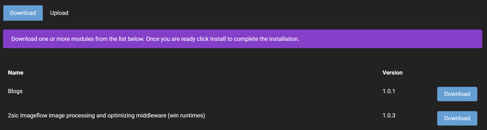

# Modules

### What is a Module?
A module is a reusable, plug-and-play piece of functionality. It's a way to extend the functionality of the framework with whatever functionality you desire. Examples of modules could be photo galleries, blogs, rotators, forms, and so on. There can be multiple modules on a page and even multiple instances of the same module on a page. It's very common to see multiple HTML modules on a single page.
When you install Oqtane, the platform ships with a base set of modules already installed in the system. There are too many that come with the solution out of the box to list here, but suffice it to say that all modules needed for basic functionality within a website come with the solution. More modules can also be downloaded for use or modules that you can created can be uploaded.

### Modules on Pages
Modules are placed onto pages in locations called “panes”. These panes are defined by the theme's designer. These themes dictates the overall look and feel of your site and is usually created by a front-end designer. Panes can span the full width of the page or be positioned in a column fashion. It may be helpful to think of panes as windows in the design of the site where you can drop in modules. You can move modules around the panes by using the [content editor](../site-administration/content-editor.md).

This is an example of a content pane.

