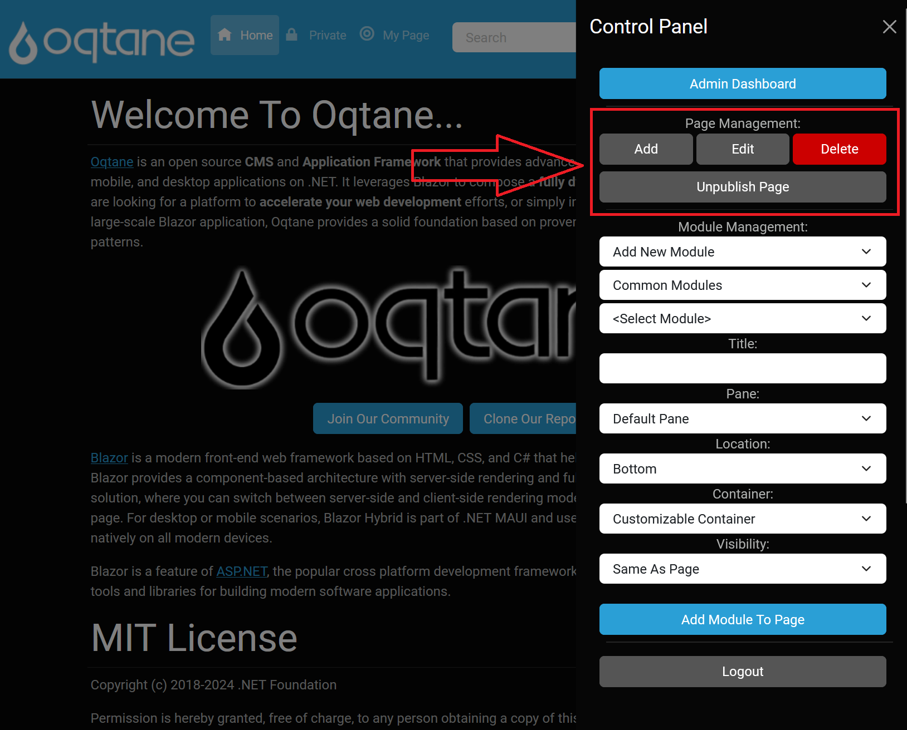
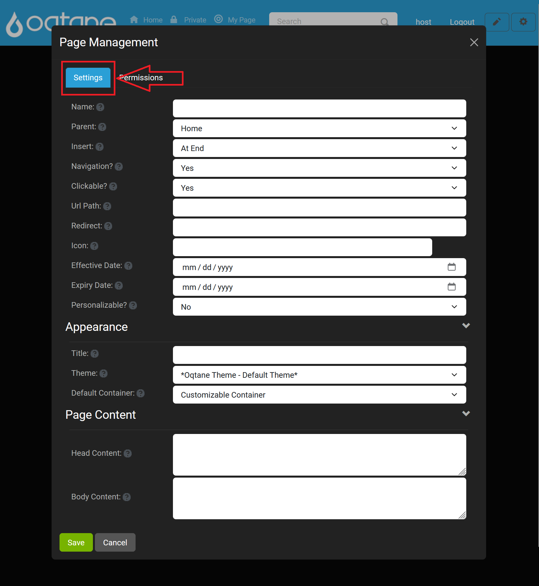
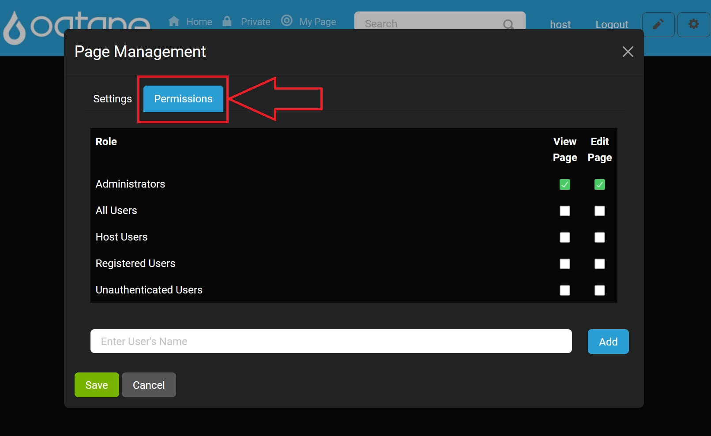
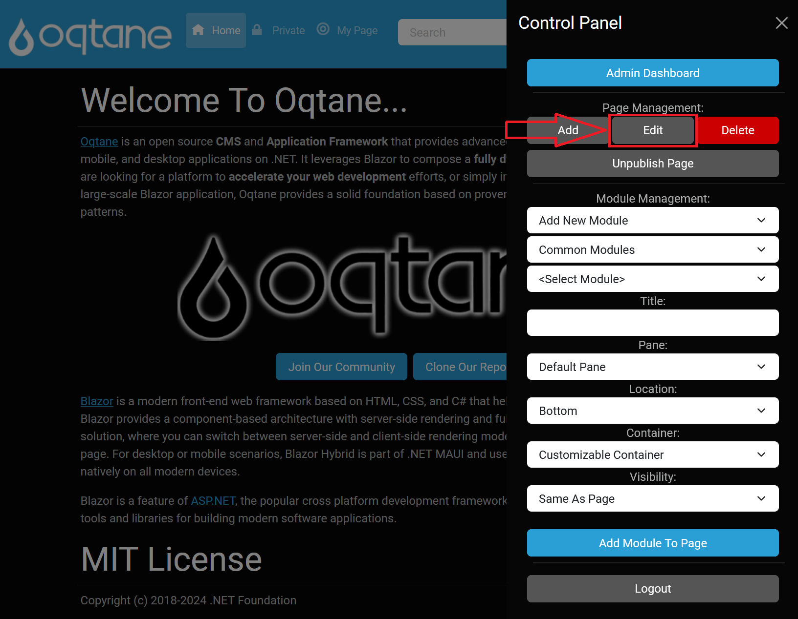
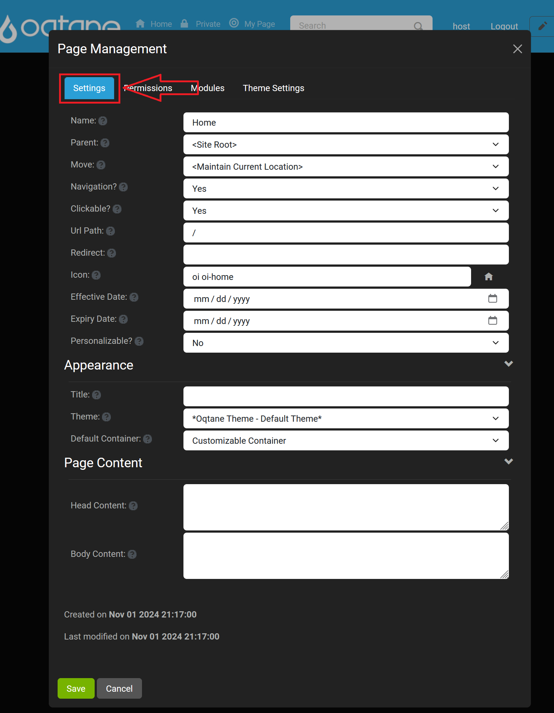
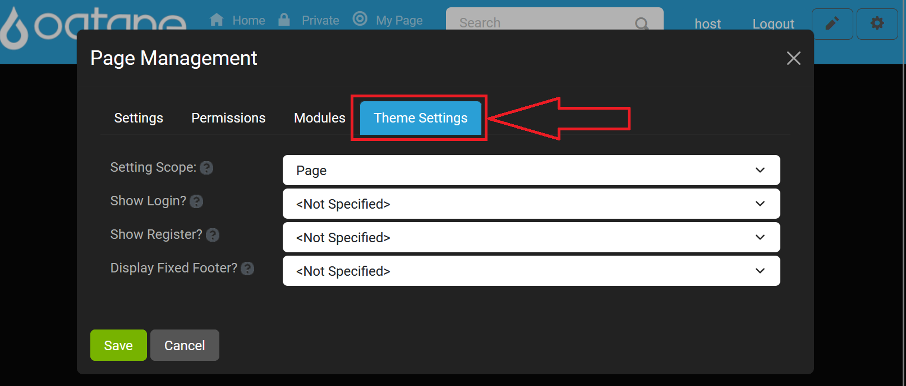
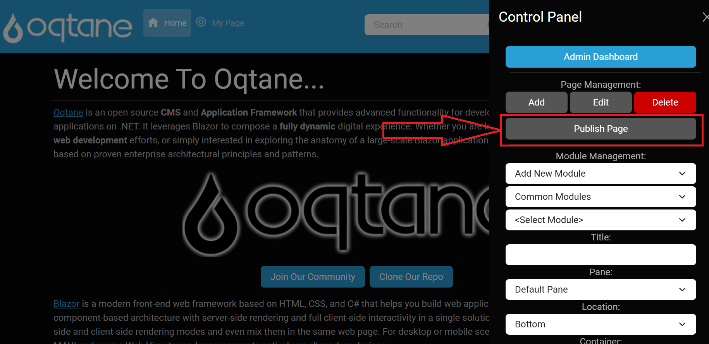

# Control Panel Page Management

The **Page Management** feature allows you to manipulate the page you are currently on by providing options for adding, editing, deleting, and publishing pages. This feature shares many capabilities with the admin dashboard's [Page Management feature](../site/page-management.md), but is limited to changing the page you are currently managing.

## Add

The **Add** feature allows you to create a new page on your website. When you select this option, a page management window will appear, enabling you to specify the following settings:

### Add Page Configuration

___

#### Settings

- **Name**: The name displayed in the navigation bar.
- **Parent**: The page that this new page will fall under in the navigation structure.
- **Insert**: Specifies the position of the page among its siblings under the selected parent.
- **Navigation**: Determines if the page should be visible to users with appropriate permissions or hidden from everyone but administrators.
- **URL Path**: Sets the URL for the page. If no path is specified, it defaults to the name.
- **Redirect**: URL to redirect users if this page is accessed. If set, you will need to use the admin dashboard’s [page management feature](../site/page-management.md) to manage this page further.

#### Appearance

- **Title**: Name displayed on the web browser tab.
- **Theme**: Select a theme from those available in the [theme management](../system/theme-management.md).
- **Layout**: Number of content panes (columns) available on the page.
- **Default Container**: Layout style for module titles above the content.
- **Icon**: URL for a favicon or other icon associated with the page.
- **Personalizable**: Allows users to customize the page uniquely for themselves.

#### Page Content

- **Head Content**: Optionally enter content to be included in the page head (ie. meta, link, or script tags)
- **Body Content**: Optionally enter content to be included in the page body (ie. script tags)

___

### Permissions

- **View**: Controls which user roles can see the page, based on settings in the admin dashboard’s [role management feature](../site/role-management.md).
- **Edit**: Grants specified roles permission to edit pages using the [content editor](content-editor.md).
- **Specific Users**: Custom permissions can be assigned to individual users.

---

## Edit

The **Edit** feature provides similar functionality to the **Add** feature but modifies the current existing page instead of creating a new one. This section allows you to update the settings, including the appearance, permissions, modules, and theme settings of the current page. The settings configuration has the **Insert** field replaced by a **Move** feature to adjust the page's position in the navigation.

Additionally, the edit panel displays the creation date and last edited date for the page at the bottom.

To edit the page:

1. Click on the **Edit** button located in the **control panel**.

2. Modify the settings, permissions, modules, and theme settings.

### Settings

As described in the **Add** section, you can modify the page's name, parent, navigation visibility, URL path, and redirect options. The only difference is that the **Insert** field is replaced by a **Move** feature for adjusting the page's position in the navigation.

### Permissions

Permissions work the same as in the **Add** feature, allowing you to control which users can view or edit the page.

### Modules

This tab allows you to manage the modules on the page, giving you the ability to modify or reorder existing modules. This provides a more granular control over the content displayed on your page.

- **Edit**: Access the module’s configuration to modify settings, permissions, and layout.
- **Delete**: Remove the module from the page.

### Theme Settings

In the Theme Settings tab, you can adjust the theme and layout of the page. This includes options for the page’s appearance, such as selecting a different theme or changing layout configurations.

- **Setting Scope**: Choose between **Site** or **Page** for theme application scope.
- **Show Login?**: Toggle login visibility (options: **Not Specified/Yes/No**).
- **Show Register?**: Toggle registration visibility (options: **Not Specified/Yes/No**).
- **Display Fixed Footer?**: Toggle a fixed footer (options: **Not Specified/Yes/No**).

By using the **Edit** feature, you can effectively customize the current page, ensuring that it meets your requirements and reflects any necessary changes.

---

## Delete

The **Delete** feature allows you to permanently remove the page you are currently managing. To delete the page, simply click the **Delete** button.

> **Warning:** This action is irreversible. Ensure that the page is no longer needed before proceeding.

---

## Publish/Unpublish

The **Publish** feature enables you to make a page public if it was previously marked as hidden. This is particularly useful for working on a page that you want to keep inaccessible to regular users until it is fully prepared for release.

To toggle the publish status, click the **Publish** button, which will switch between publishing and unpublishing the page.

---

---

## Creating an Admin Dashboard Page

If you wish to add a custom page to the **Admin Dashboard**, you can do so through **Page Management** by setting the **Parent** page to "Admin" when adding a new page. This action designates the new page as part of the Admin Dashboard, making it accessible only to administrators. Creating admin-specific pages expands the available tools for site management and customizes the Admin Dashboard.

For more information on extending the Admin Dashboard, refer to the [Admin Management documentation](../site/index.md#extending-the-admin-dashboard).

This detailed overview of the **Page Management** feature provides administrators with the essential tools to manage individual pages effectively. Each button feature is clearly defined to enhance user understanding and facilitate efficient page management.
