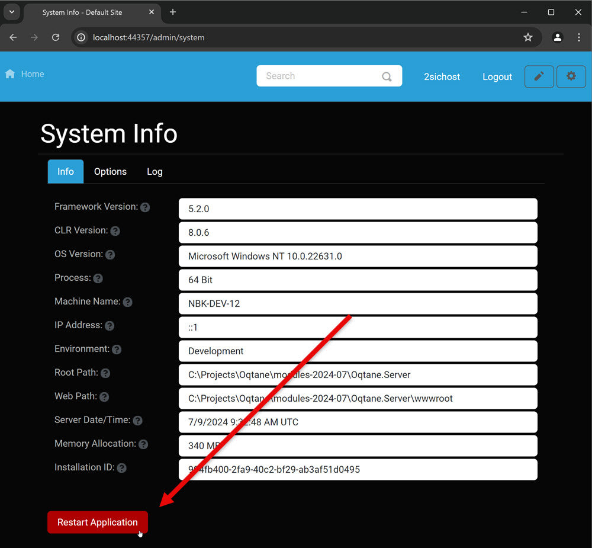
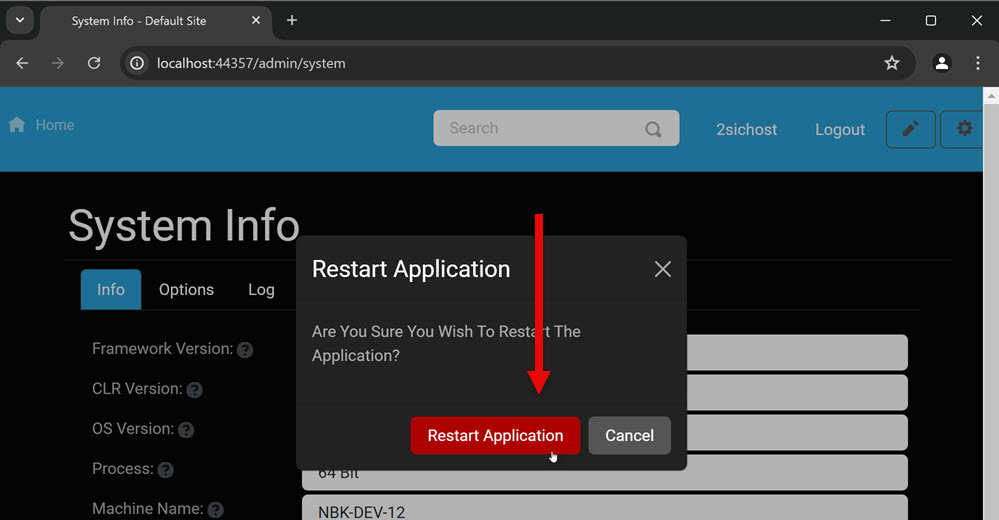
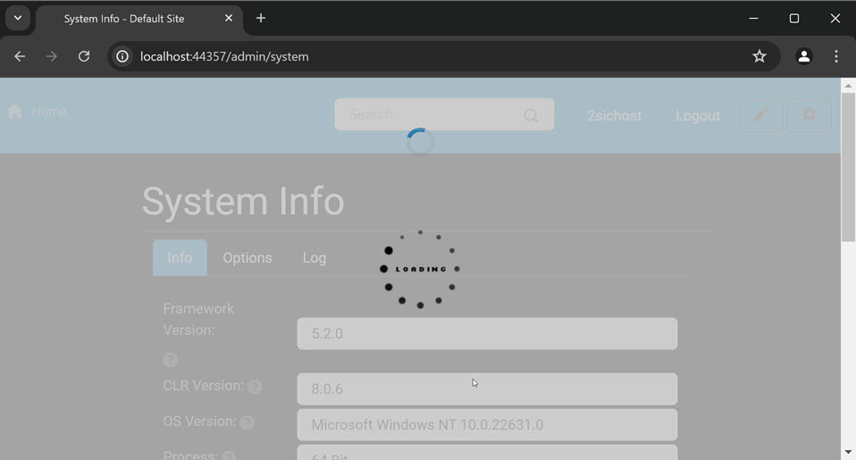
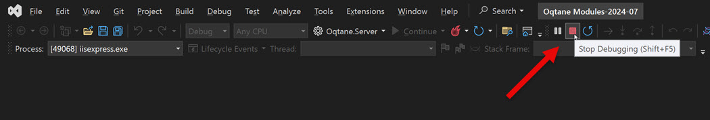
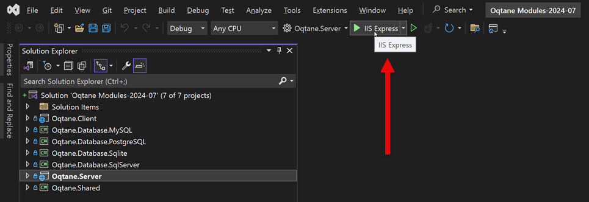

# How To Restart Oqtane

There are a few scenarios where you will want to restart Oqtane.
The most common is after installing/updating an extension.

The process is different depending on if you are running
Oqtane from Visual Studio (while developing) or if you are
running in production (typically in IIS).

## Restart Oqtane in Production

Go to `/admin/system` and hit Restart...

...confirm your choice...

...and wait for it to restart.

## Restart Oqtane in Development Mode

If you try to restart Oqtane from the **System** dialog during development,
it will only shut down Oqtane, since Visual Studio will terminate the process.
So you can use the steps above to stop Oqtane, but this makes more sense:

Stop Oqtane in Visual Studio:

...then start it again:

## Manually Force-Restart Oqtane

In special scenarios - e.g. in production when Oqtane crashes,
you may want to force-restart Oqtane.

The simplest method to do this is to open the `web.config` and save it again.
This will restart Oqtane.
