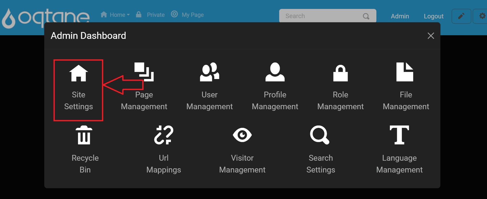
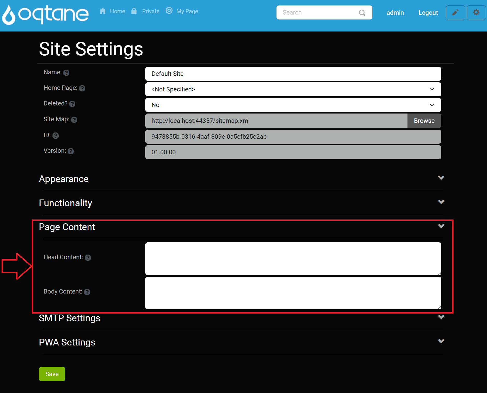
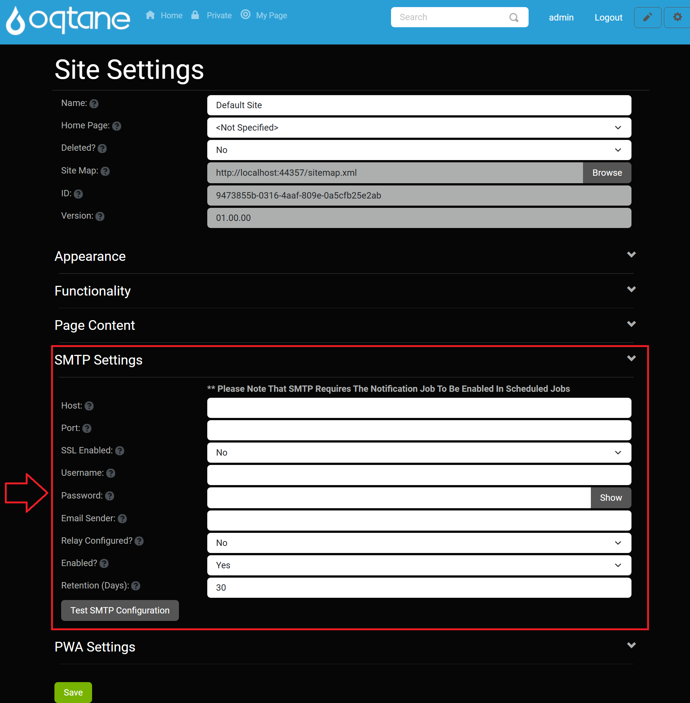
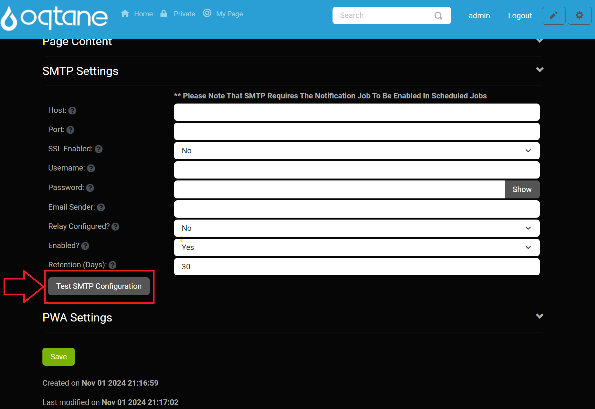
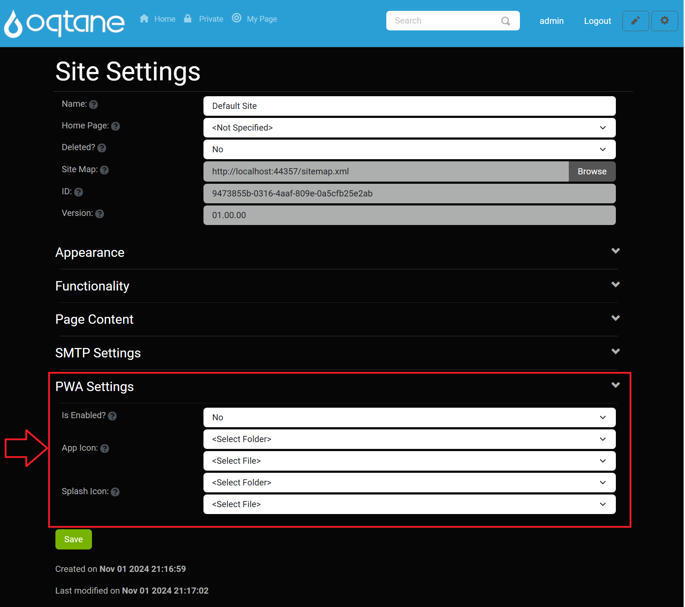

# Site Settings

## Overview

The Site Settings feature allows you to perform high-level administrative configurations for your site. This includes basic settings, SMTP configuration, and progressive web app (PWA) settings. Most options are set-it-and-forget-it and should be configured once when building your site.

## Control Panel Walk-through

### Accessing the Site Settings Feature

1. Click the control panel icon to access additional settings.

   

2. In the control panel, select the button to open the admin dashboard.

   

3. In the admin dashboard, click on the **Site Settings** icon to configure visitor tracking.

   

---

## Site Settings

The **Site Settings** management feature includes foundational settings for your site.

- **Name**: Enter the site name.
- **Home Page**: Select the home page for the site (to be used if there is no page with a path of '/').
- **Deleted?**: Indicates whether the site is deleted.
- **Site Map**: The site map URL for this site, which can be submitted to search engines for indexing.
- **ID**: The unique identifier for the site.
- **Version**: Site version for content migrations.

### Appearance

The Appearance section includes options related to the visual representation of your site.

- **Logo**: Specify a site logo using the file manager for easy selection, upload, and deletion.
- **Favicon**: Specify a favicon with the same file manager options as the logo.
- **Default Theme**: Select the site’s default theme.
- **Default Container**: Choose the default container for the site.
- **Default Admin Container**: Select the default admin container for the site.

### Functionality

The Functionality section allows you to configure essential site functionalities.

- **Text Editor**: Select the text editor for the site (default is the QuillJS editor). For more information, see the [HTML Text Editor Documentation](../content/html-text-editor.md).
- **Image Extensions**: Enter a comma-separated list of allowed image extensions.
- **Uploadable File Extensions**: Enter a comma-separated list of allowed uploadable file extensions.

### Page Content

The Page Content section lets you define additional content that can be included in your pages.

- **Head Content**: Optionally enter content to be included in the page head (e.g., meta, link, or script tags).
- **Body Content**: Optionally enter content to be included in the page body (e.g., script tags).

### SMTP Settings

**Please Note That SMTP Requires The Notification Job To Be Enabled In Scheduled Jobs**

- **Host**: Enter the hostname of the SMTP server.
- **Port**: Enter the port number for the SMTP server. This field is required if you provide a host name.
- **SSL Enabled**: Specify yes or no.
- **Username**: Enter the SMTP server username.
- **Password**: Enter the SMTP server password.
- **Email Sender**: Enter the email address from which emails will be sent. This email address may need to be authorized with the SMTP server.
- **Relay Configured?**: Only specify this option if you have properly configured an SMTP Relay Service to route your outgoing mail. This will send notifications from the user's email rather than from the Email Sender specified above.
- **Enabled?**: Specify yes or no to enable SMTP.
- **Retention (Days)**: Enter the number of days to retain notifications.
- **Test SMTP Configuration**: Button to test the SMTP configuration.

### PWA Settings

The PWA Settings section allows you to configure the Progressive Web Application capabilities of your site.

- **Is Enabled?**: Choose whether the site will be available as a Progressive Web Application (PWA).
- **App Icon**: Upload an application icon for your PWA (PNG, 192 x 192 pixels).
- **Splash Icon**: Upload a splash icon for your PWA (PNG, 512 x 512 pixels).

## Conclusion

Configuring the Site Settings correctly is crucial for the proper functioning and appearance of your site. Ensure all options are set according to your site's requirements, especially the SMTP settings for email functionality and PWA settings if you wish to enable a progressive web application experience. For further assistance, refer to other sections of the Oqtane documentation.
