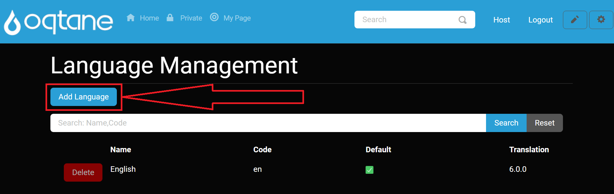
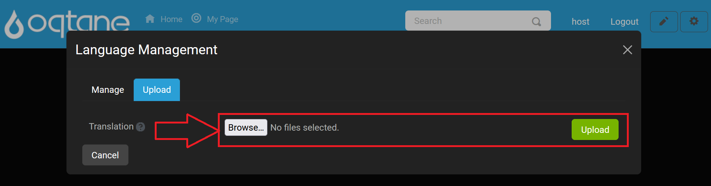
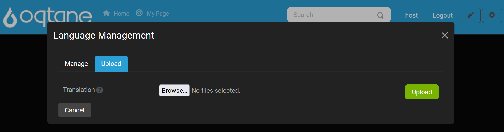

# Language Management (Host Management)

This document describes the **Language Management** module, including settings and configurations, allowing administrators and host users to manage language resources effectively across their Oqtane site.

## Overview

The **Language Management** feature enables administrators to manage translations and make site content available in multiple languages, enhancing accessibility and user experience.

---

## Control Panel Walkthrough

### Accessing the Language Management Feature

1. Click the **Control Panel** icon to access additional settings.

   

2. In the control panel, select the button to open the **Admin Dashboard**.

   

3. In the **Admin Dashboard**, click on the **Language Management** icon to configure language resources.

   

---

## Configuring Language Management

For most **Language Management** features, refer to the [Admin Management Language Management](../site/language-management.md) documentation. Here’s an overview of the key areas covered there:

- **Main Index Page**: Lists all installed languages, allowing users to edit or delete (except for the default English language).
- **Adding a Language**: Provides a modal to add a new language by name and set it as the default.
- **Searching Languages**: Filters the list of installed languages for easy management.
- **Editing and Deleting Languages**: Enables users to modify or remove languages as needed.

For further details on these features, see the [Admin Management Language Management](../site/language-management.md) page.

---

## Host-Specific Language Management Feature: Uploading Languages

In addition to the standard features available to admins, Host users can upload new translation packages to the application, adding multiple languages efficiently.

### Uploading a Language

When you click the **Add Language** button, a new **Upload** tab is available specifically for Host users, providing a file upload feature.

#### Upload Tab

1. Navigate to the **Upload** tab to access the upload feature.

   

2. Use the **Upload** feature to add one or more translation packages. This allows you to quickly expand language options by uploading pre-configured translation files.

3. If you decide not to proceed, select the **Cancel** button at the bottom left or the **X** icon at the top right of the window to exit the upload window without making changes.

   

---

## Conclusion

The **Language Management** module in Oqtane offers an accessible interface for managing language resources and translations. Host users benefit from additional features, such as uploading translation packages, which allows for efficient multilingual site configurations. For a detailed breakdown of the **Admin Management** settings, visit the [Admin Management Language Management](../site/language-management.md) documentation.

