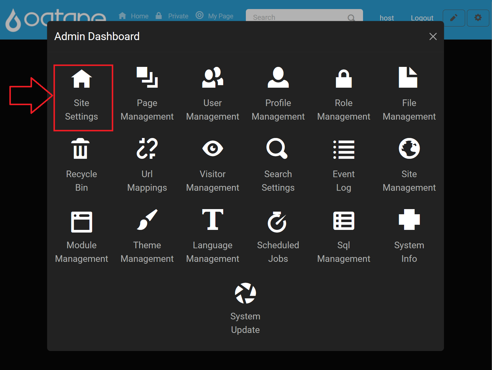
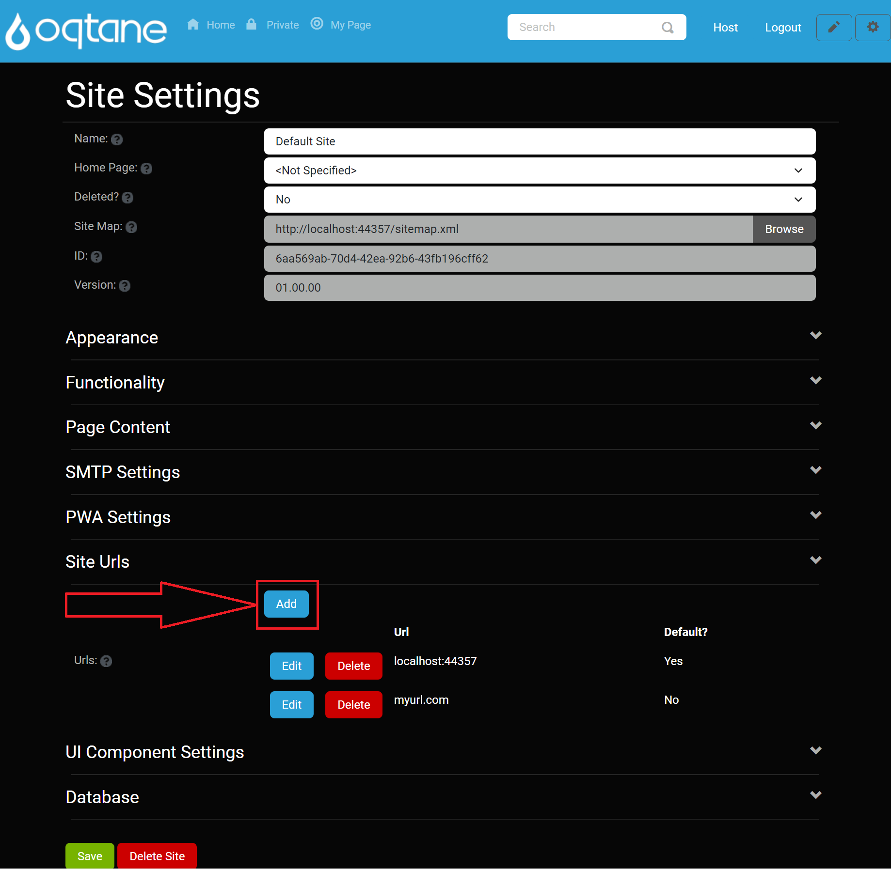
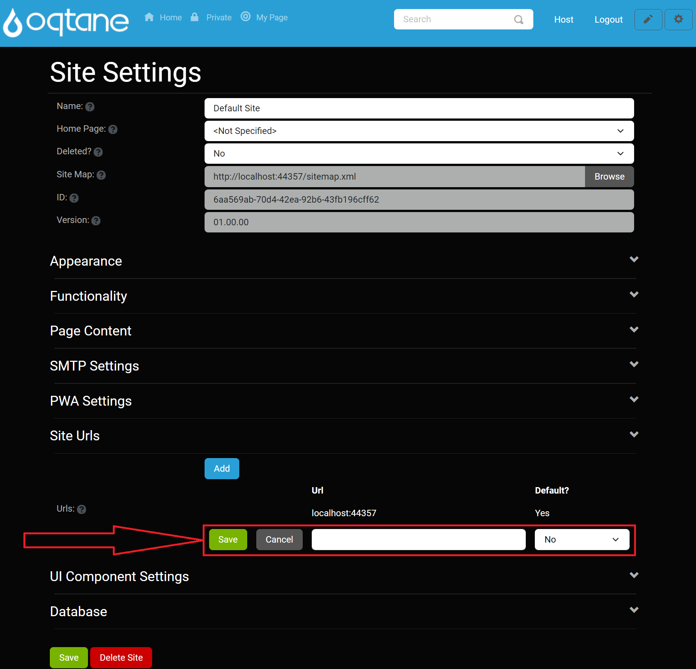
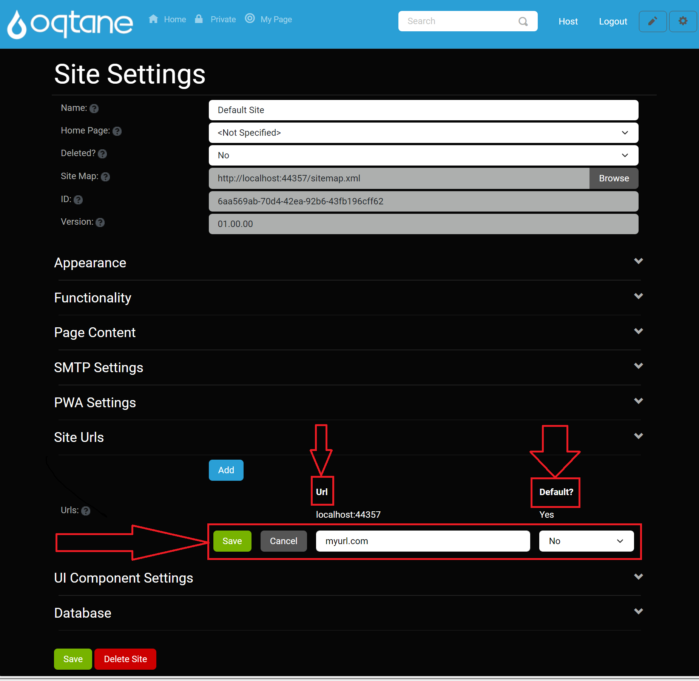
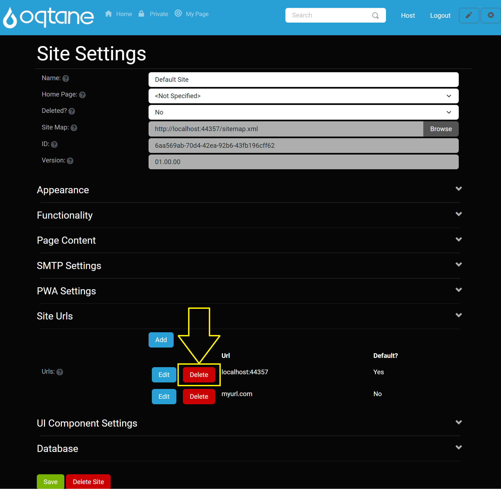
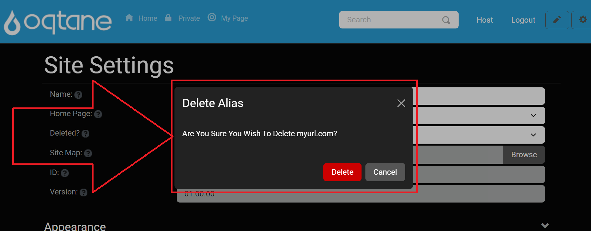
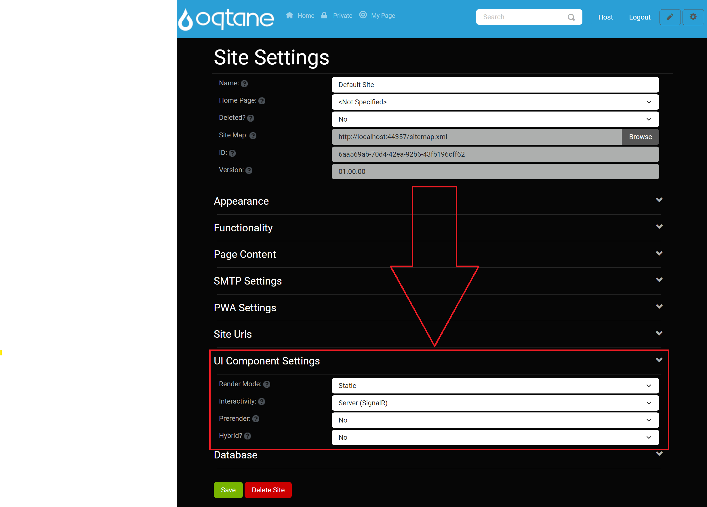
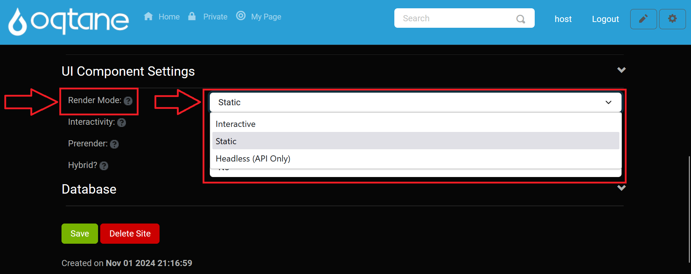
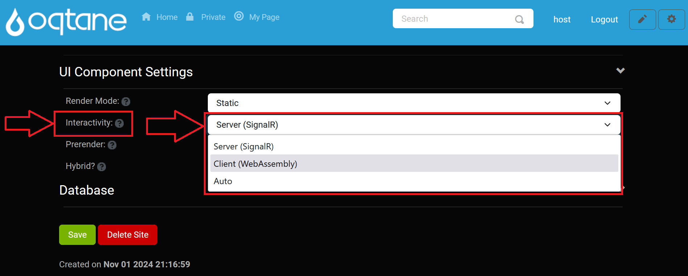
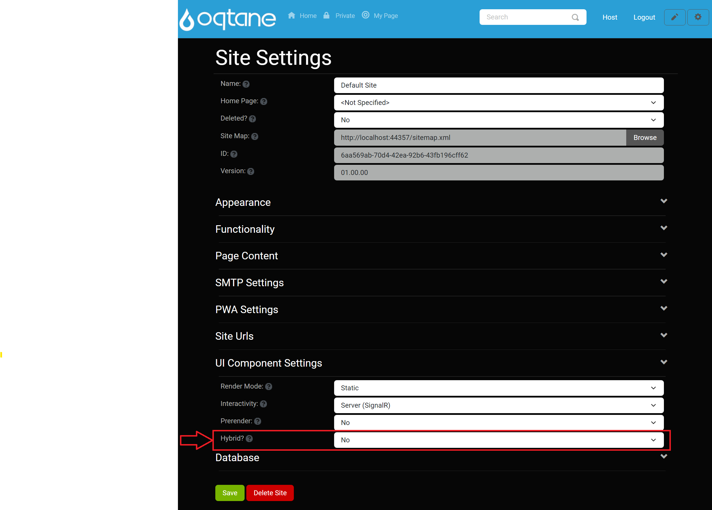

# Site Settings (Host Management)

## Overview

The **Site Settings** feature in Oqtane allows both Admin and Host users to configure site-specific options. While Admin users have access to a standard set of settings, Host users are provided with additional, advanced configuration options. This guide will summarize both types of settings and provide links to further details.

To access **Site Settings** in the Oqtane admin dashboard:

1. **Open the Control Panel**: Click the **Control Panel** icon to access additional settings.

   

2. **Navigate to the Admin Dashboard**: In the control panel, click the button to open the **Admin Dashboard**.

   

3. **Select Site Settings**: In the Admin Dashboard, click on the **Site Settings** icon to configure your site settings.

   

---

## Admin Management Site Settings

For the **Admin Management** features in **Site Settings**, see the following sections in the [Admin Management Site Settings](../site/site-settings.md) documentation:

- **Site Settings (Basic Settings)**: [Basic Settings Section](../site/site-settings.md#site-settings)
  - Configure the foundational settings for your site, including site name, homepage, and site map.

- **Appearance**: [Appearance Section](../site/site-settings.md#appearance)
  - Manage visual settings, including logo, favicon, and theme options.

- **Functionality**: [Functionality Section](../site/site-settings.md#functionality)
  - Define essential functionalities like the text editor, allowed image extensions, and uploadable file types.

- **Page Content**: [Page Content Section](../site/site-settings.md#page-content)
  - Customize additional content for pages, including head and body content.

- **SMTP Settings**: [SMTP Settings Section](../site/site-settings.md#smtp-settings)
  - Set up the SMTP server configurations required for email notifications.

- **PWA Settings**: [PWA Settings Section](../site/site-settings.md#pwa-settings)
  - Configure Progressive Web App capabilities, including icons and splash screens.

Each of these links provides detailed instructions for configuring the corresponding settings. Ensure all options are set according to your site's requirements for optimal functionality.

---

## Host-Specific Site Settings

As a Host user, you have access to additional settings that allow for more advanced site configuration. Below is an overview of these exclusive options.

### URLs

The **URLs** section lets you manage the URLs associated with your site, including domains, subdomains, or virtual folders.

- **Add a URL**:
  - Click the **Add** button.
 
   

  - Enter the **URL** in the provided field.
  - Choose **Yes** or **No** for **Default** to set it as the primary URL.
  - Click **Save** to add the URL or **Cancel** to discard changes.

   

- **Edit a URL**:
  - Click the **Edit** button next to an existing URL.
 
   

  - Modify the URL or adjust the **Default** setting.
  - Click **Save** to save changes or **Cancel** to discard them.

   

- **Delete a URL**:
  - Click the **Delete** button next to a URL.
 
   

  - Confirm deletion in the prompt window.

   

---

### UI Component Settings

The **UI Component Settings** section allows you to control render modes and interactivity options for UI components.

- **Render Mode**: The default render mode for the site, defining how components are rendered on the page.
  
   

- **Interactivity**: Specifies the render mode for components requiring interactive features.

   

- **Prerender**: Indicates if interactive components should prerender their output on the server.

   

- **Hybrid**: Determines if the site can integrate with an external .NET MAUI hybrid application.

   

---

### Database

The **Database** section provides essential database information for the site.

- **Database**: The name of the database used within the site. This is the tenant name in the framework rather than the physical database name.

- **Type**: Specifies the type of database (e.g., SQL Server, MySQL).

- **Connection**: The name of the connection string from `appsettings.json` used to connect to the database.

---

## Conclusion

The **Site Settings** for Host users offer advanced options for managing URLs, UI components, and database configurations, in addition to the standard settings accessible to Admin users. Use these settings to customize your site further and optimize performance, security, and interactivity.

For more detailed information on Admin features, refer to the [Admin Management Site Settings documentation](../site/site-settings.md).

